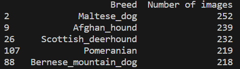
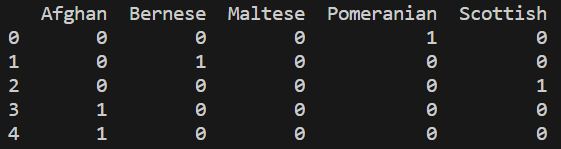
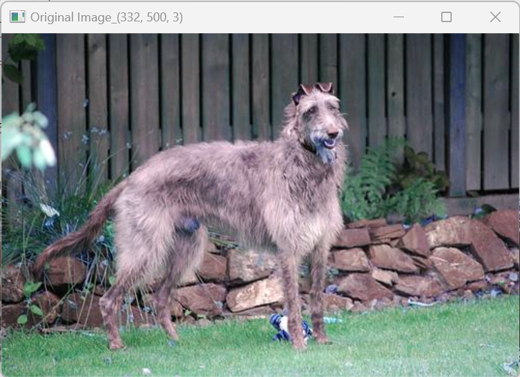
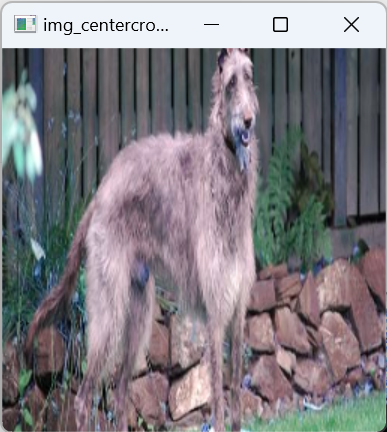
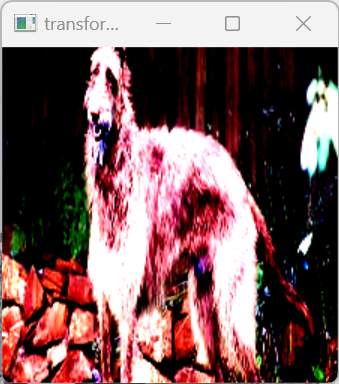
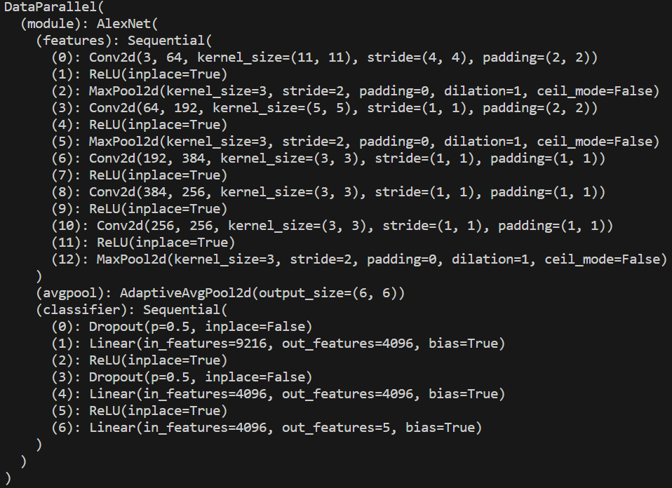
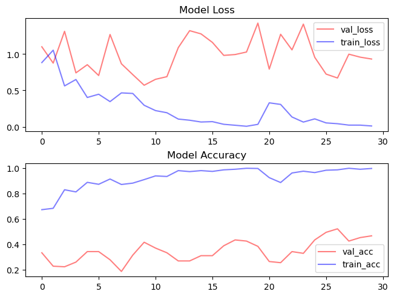
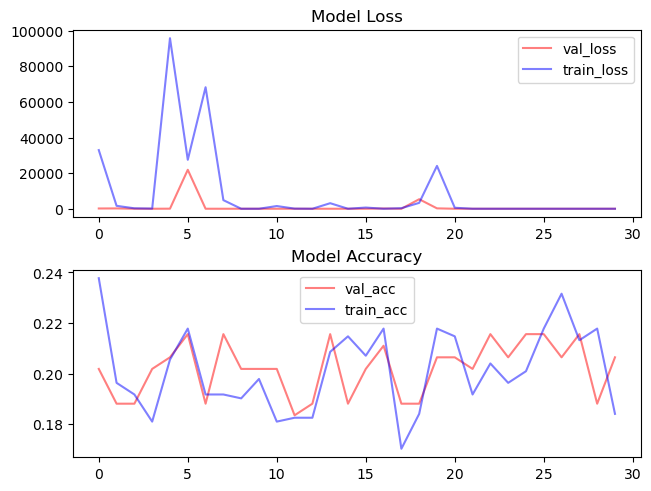
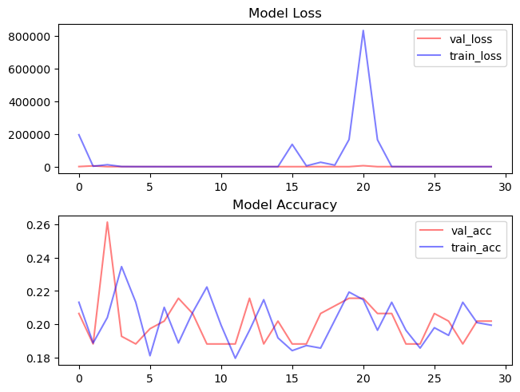
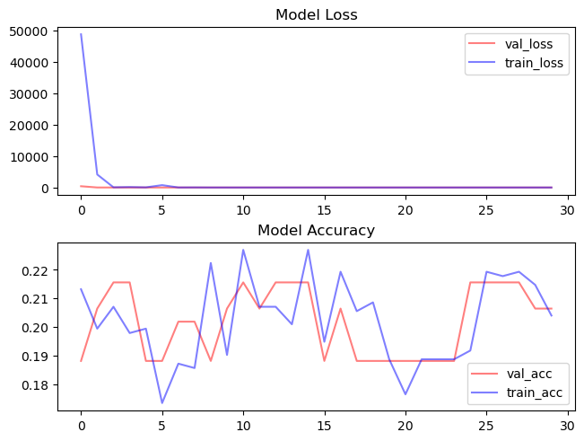

# AlexNet

### 개요
- paper :  [ImageNet Classification with Deep Convolutional
Neural Networks](https://proceedings.neurips.cc/paper_files/paper/2012/file/c399862d3b9d6b76c8436e924a68c45b-Paper.pdf)
- insight
    1. Overfitting 감소하기 위해 data Augmentation, Dropout 사용
    2. architecture에 ReLU, LRN, Overlapping pooling 사용
    3. train 과정에서 Multiple GPU 사용

---
### code reference 
- [dansuh17/alexnet-pytorch](https://github.com/dansuh17/alexnet-pytorch/blob/d0c1b1c52296ffcbecfbf5b17e1d1685b4ca6744/model.py#L40)
- [Stanford Dogs AlexNet Paper Implementation Pytorch](https://www.kaggle.com/code/virajbagal/stanford-dogs-alexnet-paper-implementation-pytorch)

---
### Ⅰ.  code 

1. Data Loading and Preparation  

1) Dataset  

- dataset.py
- dataset : [stanford_dog_dataset](http://vision.stanford.edu/aditya86/ImageNetDogs/)
- dog classes: 120,  total images: 20580
- 이 중 data 수가 많은 5 개의 class에 대해 학습 (총 1160개)

    
- data 수

    |train|val|test|
    |:---:|:---:|:---:|
    |652|128|290|
- y: onehot encoding

    

2) data preprocessing  

- datapreprocesing.py
- data Augmentation 

    ① randomResizedCrop + Horizontal Reflection
        
    ② PCA Color Augmentation (데이터의 50%만 수행)

    |  |ordinary |resize|centercrop|pac_augmentation|transform|
    |:---:|:---:|:---:|:---:|:---:|:---:|
    |img||||||
    |size|332*500|385*256| 256*256| 256*256| 224*224|

3) dataloader 

- dataloader.py
- dataloader이용하여 batch size 만큼 data 분리

2. AlexNet 

- model.py

- tretrained weight를 사용하기 위해 torchvision.models에서 제공하는 alexnet 사용
- pretrained model down : 
[AlexNet](https://www.kaggle.com/datasets/pytorch/alexnet)

- AlexNet Architecture
- 

3. Train Retults  

- main.py

- test.py

| parameter | 1st Model | 2nd Model | 3th Model | 4th Model |
|:---:|:---:|:---:|:---:|:---:|
| epochs| 30| 30 |30| 30 |
| batch_size| 128| 128 | 128| 128 |
| optimizer| SGD| SGD |Adam| Adam |
| lr_init| 0.01| 0.01 |0.01| 0.01 |
| lr_decay| -| 10epoch마다 *0.1|-| 10epoch마다 *0.1|
| momentum| 0.9| 0.9 | -| -|
|plot| ||||
|tset acc | 22.41% | 21.72% | 18.97% |22.07%|
| comment | val_loss가 줄어들지 않음. overfitting | epoch=0 일대 val_loss가 제일 적음. 학습 전혀 안됨|

 4. Comment 

- alexnet 모델의 파라미터 개수: 60 milion
- 현재 training에 사용한 이미지 개수는 652개로 finetuning하기에는 매우 부족
- 추후 paper처럼 1개의 이미지에서 2048장의 다른 이미지로 augmentation한다면 미세하게 성능 개선 기대

---
[ Reference]

- [Stanford Dogs AlexNet Paper Implementation Pytorch](https://www.kaggle.com/code/virajbagal/stanford-dogs-alexnet-paper-implementation-pytorch)