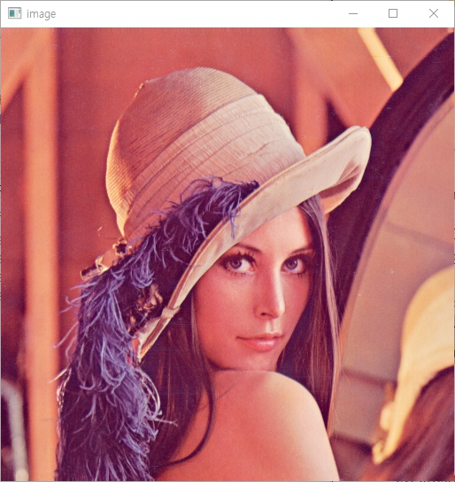
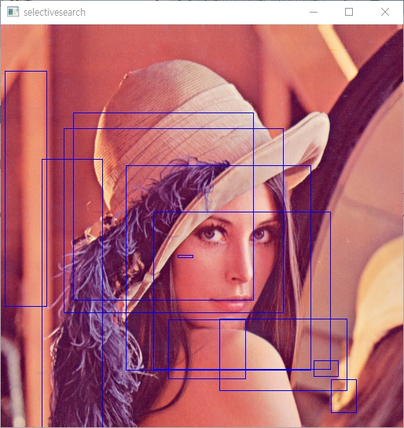

# RCNN

## 개요
- paper :  [Rich feature hierarchies for accurate object detection and semantic segmentation](https://arxiv.org/abs/1311.2524)
- insight
    1. high-capacity CNN을  bottom-up방법으로  resion 제안에 적용하기 
    -> 코드 살펴보기
    2. superviesd pre-training/ domain-specific finetunig paradigm으로 data 부족문제에 효과적
    -> 데이터를 그냥 사용했을 때와 비교해보기

---
## code reference 
- [object-detection-algorithm/ R-CNN](https://github.com/object-detection-algorithm/R-CNN/)

### code 구성
<pre>
<code>
- docs
- imgs
- py
    - utils 
        - data
            - create_bbox_regression_data.py          
            - create_classifier_data.py              
            - create_finetune_data.py                 
            - custom_batch_sampler.py                 
            - custom_bbox_regression_dataset.py       
            - custom_classifier_dataset.py            
            - custom_finetune_dataset.py              
            - custom_hard_negative_mining_dataset.py  
            - pascal_voc.py                           
            - pascal_voc_car.py
        - utils
    - bbox_regression.py                            
    - car_detector.py                              
    - finetune.py                                   
    - linear_svm.py                                 
    - selectivesearch.py    
    - data
    - utkls
</code>
</pre>    

## code 분석
### 1. dataset 준비 및 car class data 추출 
 - py > utils > data > pascal_voc_cal.py 실행 
 - PASCAL_VOC_2012 dataset 이용
 - ImageSets > main> cat_trainval.txt를 읽어 class가 car인 데이터를 train/ val, xml/jpg 파일로 나누어 데이터셋 구축 
 - class가 car인 이미지만 추출

    | 구분 | train data  | val data |
    |:---:|:---:|:---:|
    |Annotations |  590  |  571   |
    | JPEGImages |  590  | 571  |
 
 ### 2. 모델 과정
 #### 1) selectivesearch
 - py > selectivesearch.py 실행
 - opencv에 구현된 cv2.ximgproc.segmentation.createSelectiveSearchSegmentation() 이용
 - 반환값: bounding box의 좌표값 array 반환
 - test image : lena.jpg

 | 원본 이미지 | selectivesearch 이미지(초기 10개 box)|
 |:---:|:---:|
 |  |   

---
[참고]
- [Pytorch로 구현한 R-CNN 모델](https://herbwood.tistory.com/6)             

