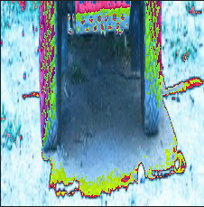

# RCNN

## 개요
- paper :  [Rich feature hierarchies for accurate object detection and semantic segmentation](https://arxiv.org/abs/1311.2524)
- insight
    1. high-capacity CNN을  bottom-up방법으로  resion 제안에 적용하기 
    -> 코드 살펴보기
    2. superviesd pre-training/ domain-specific finetunig paradigm으로 data 부족문제에 효과적
    -> 데이터를 그냥 사용했을 때와 비교해보기

---
## code reference 
- [object-detection-algorithm/ R-CNN](https://github.com/object-detection-algorithm/R-CNN/)

---
## Ⅰ.  code 구성

code 구성

    <pre>
    <code>
    - docs
    - imgs
    - py
        - utils 
            - data
                - create_bbox_regression_data.py          
                - create_classifier_data.py              
                - create_finetune_data.py                 
                - custom_batch_sampler.py                 
                - custom_bbox_regression_dataset.py       
                - custom_classifier_dataset.py            
                - custom_finetune_dataset.py              
                - custom_hard_negative_mining_dataset.py  
                - pascal_voc.py                           
                - pascal_voc_car.py
            - utils
        - bbox_regression.py                            
        - car_detector.py                              
        - finetune.py                                   
        - linear_svm.py                                 
        - selectivesearch.py    
        - data
        - utkls
    </code>
    </pre>    

## Ⅱ. code 분석

1. dataset 준비 및 car class data 추출 

- py > utils> data > pascal_voc.py 실행 (dataset download)
- py > utils > data > pascal_voc_cal.py 실행 
- PASCAL_VOC_2007 dataset 이용
- ImageSets > main> cat_trainval.txt를 읽어 class가 car인 데이터를 train/ val, xml/jpg 파일로 나누어 데이터셋 구축 
- class가 car인 이미지만 추출

    | type | train   | val  |
    |:---:|:---:|:---:|
    |Annotations |  590  |  571   |
    | JPEGImages |  590  | 571  |

2. dataset 생성 및 저장 

1) CNN 모델(AlexNet)을 finetune하기 위한 dataset 

#### (1) selectivesearch
> - py > selectivesearch.py 실행
> - opencv에 구현된 cv2.ximgproc.segmentation.createSelectiveSearchSegmentation() 이용
> - 반환값: bounding box의 좌표값 array 반환
> - test image : lena.jpg

| 원본 이미지 | selectivesearch 이미지(초기 20개 box)|
|:---:|:---:|
|  |   

- 000012.jpg 이미지에서 찾은 box: 4648개

#### (2) CNN 모델(AlexNet)을 fine-tuning을 위한 annotation 데이터 생성
> - py > utils > data > create_finetune_data.py 실행
>- 이미지마다 selectivesearch로 찾은 predict box와 PASCAL_VOC dataset에 저장된 xml 파일의 Ground Truth를 비교
>- IoU가 0.5 이상이면 positive, 아니면 negative로 labeling
> | type | train   | val  |
> |:---:|:---:|:---:|
> |positive |  66122  |  64040   |
> | negative |  454839  | 407548  |
>- 상기 결과를 파일이름_0.csv, 파일이름_1.csv로 저장
> - 000012.jpg 이미지에서 selectivesearch한 4648개의 box중 IoU와 box area를 고려하여 positive 339개, negative 1116개 box를 선택

| positive_label | negative_label|
|:---:|:---:|
|  |   

2) Linear SVM을 학습하기 위한 dataset 

> - Linear SVM을 학습하기 위한 annotation 데이터 생성
> - py > utils > data > create_flassifier_data.py 실행
> - 상기 CNN모델을 fine-tuning하기 위한 과정과 비슷하나 data를 positive, negative로 labeling 하는 과정이 다름
> - groun truths의 box를 positive로, selective search가 찾은 box 중 IoU가 0.3보다 작고 면적을 고려하여 negative로 labeling
> - 상기 결과를 파일이름_0.csv, 파일이름_1.csv로 저장
> - 000012.jpg 이미지에서 selectivesearch한 4648개의 box중 IoU와 box area를 고려하여 positive 1개, negative 803개 box를 선택

| type | train   | val  |
|:---:|:---:|:---:|
|positive |  625  |  625   |
|negative |  366028  | 321474  |

 | positive_label | negative_label|
 |:---:|:---:|
 |  |  |

3) Bounding box Regressor 학습을 위한 dataset 

> - Bounding box Regressor 학습을 위한 annotation 데이터 생성
> - py > utils > data > create_bbox_regression_data.py 실행
> - CNN을 fine-tuning하기 위해 생성한 positive box 중 IoU가 0.6 이상인 data만 사용
> -  000012.jpg 이미지에서 finetuning을 위한 positive 이미지  339개의 box중 IoU 고려하여 231개 box를 선택

| positive_bbox1 | positive_bbox2|positive_bbox3|
 |:---:|:---:|:---:|
 |  |  |  | 

3. custom dataset 정의 

>- 모델에 사용하기 위해 data type 정의

1) CNN모델을 fine_tuning하기 위한 custom dataset 

> - py > utils > data > custom_finetune_dataset.py 실행
> - 원본 이미지를 하나의 list에 저장
> - create_funetune_data.py에서 생성한 image annotation의 좌표값과 개수를 positive, negative로 나누어 각각 list에 저장
> - jpeg_image: 376장
> - positive_box : 66,122개
> - negative_box : 454,839개
> - total_box : 520961

 2) Linear SVM을 학습하기 위한 classifier dataset 정의 

> - py > utils > custom_classifier_dataset.py
> - 3개의 test()함수
    >> - test() : classifier_car/val 이미지와 positive, negative box coor 저장
    >> - test2() : classifier_car/train 이미지와 positive, negative box coor 저장,  transform. Compose()를 이용하여 (227 * 227 )size로 wrap하고, tensor 형식으로 변환
    >> - test3() : DataLoader를 이용해 batch_size 128, num_workers 8로 학습할 준비 , input size : [ 128, 3, 227, 227 ]
    
|type| positive_label | negative_label|
|:---:|:---:|:---:|
| 원본 | |  |
|227 * 227 |  |  |

   

 3) bbox regression을 학습하기 위한 dataset 정의 

- py > utils > custom_bbox_regression_dataset.py
- 이미지 box의 coor값이 아닌 positive, ground_truth의 값을 적절히 조절해서 t의 x, y, w, h값을 구해서 dataloader 형식으로 준비

 4) 학습을 위한 batch sampler 

- py > utils > data > custom_batch_sampler.py

- positive, negative data(총 520961)를 mini batch(num_iter : 4070)로 구성한 뒤, suffle
- positive batch : 32 / negative batch : 96

 4. model train 

 1) pre_trained 된 AlexNet Fine_tuning 

- py > utils > finetune.py

- pretrained AlexNet의 마지막에 Fully Connectied layer 추가
(출력되는 output unit = classes 수 + 1(배경)이므로, 이 코드에서는 자동차에 대한 분류만 진행하므로 output unit 수 = 2)
 
- model structure 

 

- loss function: CrossEntoropyLoss
- optimiser : SGD
- parameter

| learning rate | momentum | epoch |
|:---:|:---:|:---:|
||1e-3|0.9|25|

- best val accuracy : 0.873293
- accuracy, loss

|accuracy|loss|
:---:|:---:|
|| |

 2)liear SVM   

- py > utils > linear_svm.py

- finetuing한 AlexNet모델의 마지막 layer를 학습시켜 object(positive)인지 background(netative)인지 classification 진행

- Hard Negative Mining
    - 학습 데이터의 class: positive(object), negative(background)
    - 클래스 불균형(positive data < negative data)이므로 균형있게 학습하기 위해 positive sample과 negative sample의 비율을 1:1로 맞춰 학습 
    - 남은 negative sample을 linear SVM 모델에서 한번 더 학습

- Hing loss function
    - 최대 마진 분류를 외한 SVM에 사용하는 loss function
- parameter
| learning rate | momentum | epoch |
|:---:|:---:|:---:|
||1e-4|0.9|10|

-  accuracy, loss 

|accuracy|loss|
:---:|:---:|
|| |

 3)box regressor   

- py > utils >  bbox_regression.py

- finetuned AlexNet의 마지막 layer에 fully conneted layer(num of nuit = 4)를 추가

- loss function : MSE(Mean Squred Error)
- optimizer: Adam
- parameter

| learning rate | weight_decay | epoch |
|:---:|:---:|:---:|
||1e-4|1e-4|12|

-  loss

---

## Ⅲ. object detection

- py > utils > car_detector.py

 1. data preprocession   

- input image에서 selective search로 찾은 bbox를 (227, 227) 크기로 wrapping

|input image|selective search image| wrap image|
:---:|:---:|:---:|
|| ||

2. model and result   

- selectivesearch로 찾은 2306개 중 model output의 결과 positive가 높은 box를 찾고
  그 중에서 svm threshold(0.3) 이상인 box 34개를 찾음
- Non maximum suppression을 적용해서, positive 확률이 가장 큰 값을 가진 box와 나머지 box와의 iOU값을 계산해서  0.3이상인 box 19개를 찾음

||result1|result2| result3|
|:---:|:---:|:---:|:---:|
|img|| ||
|prob|0.74|0.70|0.67|

 
 

---
[Reference]
- [Pytorch로 구현한 R-CNN 모델](https://herbwood.tistory.com/6)        
-      

